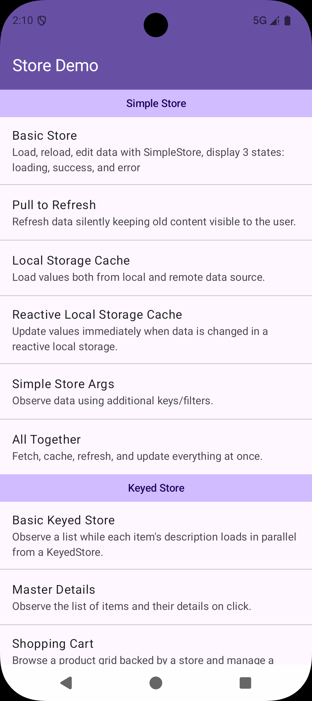

# Store Demo App

A sample Android application that showcases the [**Store**](../store/README.md)
library through a catalog of small, self-contained examples. Each example is a
runnable screen that demonstrates one concept - loading and caching a single
value, keeping data in sync with a local storage, observing per-key values,
paginating an endless list, and more.

The app is written entirely in **Jetpack Compose**, wired together with
**Hilt** for dependency injection and **Navigation 3** for navigation. Fake
data is generated on the fly with [JavaFaker](https://github.com/DiUS/java-faker),
and every data source deliberately adds an artificial delay (and an optional,
toggleable failure) so you can watch the `Loading`, `Loaded` and `Failed`
states play out in real time.

<p align="center">
  
</p>

## Running the app

The demo is a module of this repository. Open the project in Android Studio and
run the `app-store-demo` configuration, or from the command line:

```bash
./gradlew :app-store-demo:installDebug
```

Requires Android API 24+.

## How it is organized

The home screen (shown above) lists every example grouped by the store type it
demonstrates. Tapping an entry opens the corresponding screen.

- Each example is declared once in
  [`Example.kt`](src/main/java/com/elveum/store/demo/navigation/examples/Example.kt)
  with its title, description, category and Composable content, and registered
  in [`ExampleRegistry.kt`](src/main/java/com/elveum/store/demo/navigation/examples/ExampleRegistry.kt).
- The three categories (`Simple Store`, `Keyed Store`, `Paged Store`) come from
  [`Category.kt`](src/main/java/com/elveum/store/demo/navigation/examples/Category.kt).
- Every feature lives under
  [`feature/examples/`](src/main/java/com/elveum/store/demo/feature/examples)
  and follows the same layers: a **data source** (fake network/local backend),
  a **repository** (owns the `Store` built via `StoreFactory`), a **ViewModel**
  (exposes a `StateFlow<StoreResult<…>>`, usually through a
  `StoreResultReducer`), and a Compose **screen**.

A global **error toggle** ([`ErrorFlagStore`](src/main/java/com/elveum/store/demo/errors/ErrorFlagStore.kt))
lets data sources simulate failures on demand, so you can trigger the `Failed`
state - and features such as *keep content on error* - from the UI.

## The examples

### Simple Store

`SimpleStore<T>` caches a single value. These examples build up from the
minimal setup to a screen that combines every feature at once.

| Example                          | Demonstrates                                                                                                                                                            |
|----------------------------------|-------------------------------------------------------------------------------------------------------------------------------------------------------------------------|
| **Basic Store**                  | Load, reload and edit a user profile with `SimpleStore`; renders the three states - loading, success and error - and performs an `optimisticUpdate` on edit.            |
| **Pull to Refresh**              | Reload silently with `LoadRequest.Silent` so the old content stays visible while a background refresh runs, driving the refresh indicator from `isBackgroundLoading()`. |
| **Local Storage Cache**          | Attach a suspending local storage via `addSuspendingLocalStorage()`: cached data shows instantly while a fresh value is fetched from the remote source.                 |
| **Reactive Local Storage Cache** | Attach a `Flow`-based local storage via `addReactiveLocalStorage()`: changes written to the local source are pushed to observers automatically.                         |
| **Simple Store Args**            | Parameterize a store with additional keys/filters, re-fetching when the argument changes.                                                                               |
| **All Together**                 | A gallery screen that fetches, caches, refreshes and optimistically updates everything at once.                                                                         |

### Keyed Store

`KeyedStore<Key, T>` behaves like a map of stores - one independently cached
value per key.

| Example               | Demonstrates                                                                                                                                                          |
|-----------------------|-----------------------------------------------------------------------------------------------------------------------------------------------------------------------|
| **Basic Keyed Store** | Observe a list while each item's description loads in parallel from a `KeyedStore` (via `storeListFlatMapLatest`), rendering placeholders until each value arrives.   |
| **Master Details**    | A master-detail flow where the list and the details screen share the same cached per-key value; updates are visible on both.                                          |
| **Shopping Cart**     | Browse a product grid backed by a store and manage a shared cart across two screens, using `storeMap`, `storeListFlatMapLatest`, `optimisticUpdate` and `updateWith`. |

### Paged Store

`PagedStore<T>` loads data page by page and merges the pages into one list for
endless scrolling.

| Example                            | Demonstrates                                                                                                                             |
|------------------------------------|------------------------------------------------------------------------------------------------------------------------------------------|
| **Pagination Basics**              | Fetch pages on demand with an initial key; new pages load automatically as the user scrolls near the end (`onItemRendered`).             |
| **Pagination Statuses**            | Combine pull-to-refresh, incremental paging and error handling; a checkbox toggles simulated failures to exercise every next-page state. |
| **Pagination with Args**           | Add a category filter as a query argument; toggling a chip restarts paging from the first page with the new filter.                      |
| **Pagination with Updates**        | A paged list where each item carries a Like toggle that can be flipped independently of pagination.                                      |
| **Pagination with 2 Data Sources** | A paged list where each item is fetched from both a local cache and a remote source.                                                     |

## Where to look first

If you are new to the library, start with **Basic Store**
([`store_simple/basic`](src/main/java/com/elveum/store/demo/feature/examples/store_simple/basic)):

- [`UserProfileRepository`](src/main/java/com/elveum/store/demo/feature/examples/store_simple/basic/UserProfileRepository.kt)
  builds a `SimpleStore` with `StoreFactory.simpleStoreBuilder()`, exposes it as
  a `Flow<StoreResult<UserProfile>>`, and updates it optimistically.
- [`UserProfileDataSource`](src/main/java/com/elveum/store/demo/feature/examples/store_simple/basic/UserProfileDataSource.kt)
  is the fake backend that adds a delay and honors the global error flag.

From there, each feature mirrors the same structure, so you can jump straight to
the store type you are interested in.

## Learn more

The full library documentation lives alongside the source:

- [Store - main guide](../store/README.md)
- [Simple Store](../store/docs/simple-store.md)
- [Keyed Store](../store/docs/keyed-store.md)
- [Paged Store](../store/docs/paged-store.md)
- [Store Results](../store/docs/store-results.md)
- [Load Requests](../store/docs/load-requests.md)
